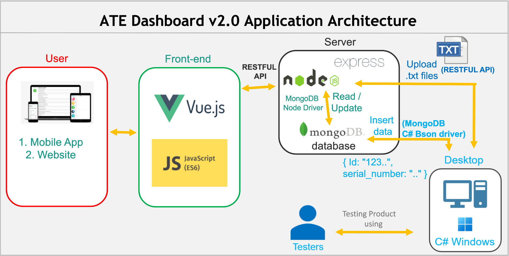

# ATE Dashboard v2.0
ATE Dashboard v2.0 is the second generation of ATE Dashboard that is built to help ATE monitors the production test activity. 
1. The technologies used in this project are **MongoDB + Express + VueJS + NodeJS (MEVN)**. 
2. For better understanding, please read the [Architecture](#architecture) section. 
3. For the **development installation**, please refer to [Getting Started](#getting-started). 
4. For **deployment**, refer to [Deploy On Docker](#deploy-on-docker).

## Architecture


### Technology References
1. VueJS retrieves data by using RESTFUL API (NodeJS + Express)
You could check the API url in server router (_server/routers/index.js_) <br>
Note: every URL will be begun with `/api` e.g. `GET http://localhost:8000/api/tests/all`.
2. NodeJS + Express retrieves data from MongoDB using [MongoDB Node Driver](https://docs.mongodb.com/drivers/node/current/). <br> Current code uses v3.6 which is compatible with MongoDB v3.6 and v4+ (Compatibility check [here](https://docs.mongodb.com/drivers/node/master/compatibility/))
3. C# Program inserts data to MongoDB using [MongoDB C# Bson driver](https://docs.mongodb.com/drivers/csharp/)
4. **However**, C# Program uploads the .txt (Data, log, ComportText, TelnetText) to the NodeJS server using RESTFUL API.

## Getting Started

### Prerequisites
1. Install NodeJS v14.17.0 (I suggest you to use [nvm-windows](https://github.com/coreybutler/nvm-windows) or [nvm](https://github.com/nvm-sh/nvm) if you use other OS beside Windows). You also could directly download and install from official [NodeJS](https://nodejs.dev/).
2. Install [MongoDB](https://www.mongodb.com/try/download/community) v4.4.6. Follow this [instruction](https://dotblogs.com.tw/explooosion/2018/01/21/040728)

### Installation
1. Clone the repo<br>
`git clone http://gitlab.jazzhipster.com.tw:30000/team_ate/Dashboard-V2/ate.git`

2. Go to _server_ folder <br>
`cd server`

3. Install NPM packages<br>
`npm install`

4. Run the server (Backend)<br>
`npm run serve`

5. **Open new terminal** and go to _client_ folder<br>
`cd client`

6. Install NPM packages<br>
`npm install`

7. Run the client (Frontend)<br>
`npm run serve`

8. Open browser and type `localhost:8080`

### Deploy on Docker
**Notes**: Before build and running below commands, make sure you don't have any images named _dashboard-server_ and _dashboard-client_. If yes, please name your image with other name.<br>
Also ensure to free port **:8080** and **:80**

#### Build & Run Projects Container

1. Install **MongoDB, client(VueJS), and server (NodeJS)** using [MongoDB Docker Official Images](https://hub.docker.com/_/mongo) [docker-compose.yml](docker-compose.yml) and run these below commands<br/>
`docker-compose up -d`

2. Install MongoDB Compass in your computer, then connect to your **admin** database with **username** and **password** in your docker-compose.yml

3. Then, Create Database named `ate_mongodb` with collection name `auth_users`, `ate_projects`, `ate_logs`, `ate_files` and `ate_tests`.
Configure the `DB_HOST` url in [config.js](server/config/config.js) with
```
DB_HOST: 'mongodb://<username>:<password>@<ip_address>:27017/?authSource=admin&readPreference=primary&appname=MongoDB%20Compass&ssl=false'
```
4. Open browser, go to _http:<ip_address>_ e.g. `http://192.168.100.150`, it will redirect you to Login page

References:
- server: https://nodejs.org/en/docs/guides/nodejs-docker-webapp/
- client: https://cli.vuejs.org/guide/deployment.html#docker-nginx
