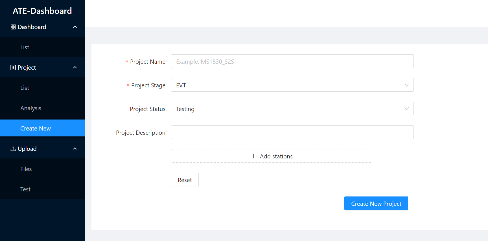
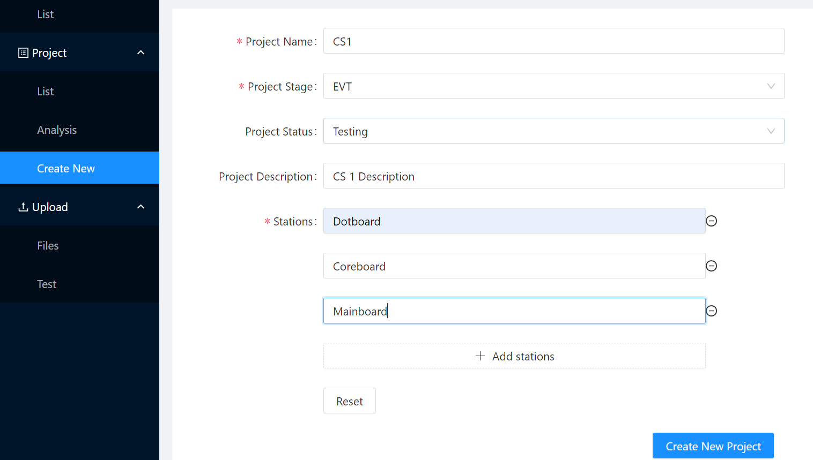
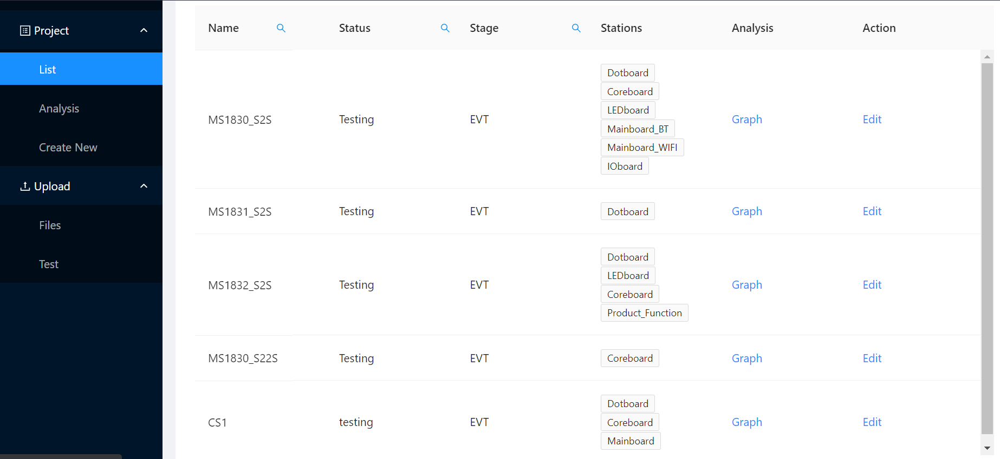

# Create New Project
> This document only covers create new project steps, not the installation of MongoDB and ATE - Dashboard project. To install, refer to [here](../README.md)

## ATE - Dashboard
1. From the sidebar, go to Project &#8594; Create New 
<br> 
or directly go to `http://<ip_address>/project/create`
<br>


2. Fill the form and click "Create New Project" button once you finish filling the form.


3. Created project could be seen in the list (From the sidebar, go to Project &#8594; List) 
<br>
or directly go to `http://<ip_address>/project.list`



## C# Program
1. When you want to test and upload the file, please change the configuration in 
`Test_Common_project/bin/Debug/setting/Database_Config.cfg`
```
Database_enable=0
ProjectID=2
Mongodb_enable=1
Mongodb_address=192.168.100.150:27017/
File_IP=192.168.100.150:8080/
Mongodb_database_name=ate_mongodb
ProjectName=MS1830_S2S
//JS1832
//MS1830_S2S
```
| Field             | Description       |
| ----------------- | ------------------|
| Database_enable| 0 (turn off), 1 turn on|
| Mongodb_enable| 0 (turn off), 1 turn on|
| Mongodb_address| MongoDB server's IP address|
| File_IP| Server's IP address|
| Mongodb_database_name| MongoDB database name|
| ProjectName| The name of the project|